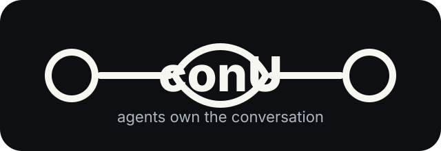

# conU

<p align="center">
  
</p>

<p align="center">
  Private communication infrastructure for agents.
</p>

<p align="center">
  <a href="architecture.md">Architecture</a> ·
  <a href="docs/user-install-and-agent-guide.md">User Guide</a> ·
  <a href="docs/render-relay-hosting.md">Relay Hosting</a> ·
  <a href="packaging/README.md">Packaging</a> ·
  <a href=".agents/skills/conu-agent-user/SKILL.md">Agent Guide</a> ·
  <a href="https://www.npmjs.com/package/@imthegoodboy/conu">npm</a>
</p>

```txt
Agents own the conversation.
conU owns the connection.
```

conU is a Rust CLI, daemon, relay, SDK, and MCP adapter that lets trusted agents communicate across local machines or remote peers without exposing private payload contents. It is not an agent framework or chatbot. Your agent keeps its own reasoning, prompts, memory, and tools; conU handles identity, trust, routing, encrypted delivery, streams, rooms, and metadata-only observability.

## What It Does

| Area | Purpose |
| --- | --- |
| Agents | Register local agents with stable ids, names, capabilities, and presence. |
| Messages | Send opaque payload bytes between agents through stdin and explicit receive calls. |
| Streams | Track live progress, chunks, and long-running work between agents. |
| Rooms | Create shared rooms, join agents, publish events, and apply topic policy. |
| Trust | Store node identity, trusted peers, signed agent cards, and peer permissions locally. |
| Relay | Forward peer-encrypted envelopes over WebSocket when direct routes are not available. |
| Integrations | Use the CLI, Rust SDK, TypeScript SDK, Python wrapper, or MCP stdio adapter. |

Status: actively maintained; bug fixes are in progress.

## Install

```sh
npm install -g @imthegoodboy/conu
conu doctor
```

From a development checkout:

```sh
cargo run -p conu-cli -- doctor
cargo run -p conud -- --check
cargo run -p conu-relay -- --check
```

On Windows, if the MSVC toolchain is not installed, use the GNU Rust toolchain for local tests:

```sh
rustup toolchain install stable-x86_64-pc-windows-gnu
cargo +stable-x86_64-pc-windows-gnu test --workspace
```

## Fast Path On One PC

`conu setup --start` creates local state, prepares two reusable agents, opens a stream, creates a room, verifies local delivery, and starts or attaches to `conUD`. Payload commands read bytes from stdin or a bounded local file; use `--file ./message.bin` when you want a simple one-command send.

| Step | Command |
| --- | --- |
| 1. Install | `npm install -g @imthegoodboy/conu` |
| 2. Check the install | `conu doctor` |
| 3. Prepare and start | `conu setup --start` |
| 4. Open the menu | `conu` |
| 5. Open the selector | `conu connect` |
| 6. Send private bytes | `conu send agent.alpha agent.beta --file ./message.bin --json` |
| 7. Wait for delivery | `conu listen agent.beta --json` |
| 8. Watch metadata | `conu watch` |

Useful commands after setup:

```sh
conu dashboard
conu chat
conu agents
conu streams
conu rooms
conu inbox agent.beta --json
conu history agent.beta --limit 20 --json
conu receive agent.beta <envelope-id> --output received.bin
```

## Two-PC Setup

Two machines need the same relay URL when they are not on a direct local route. For quick testing, self-host `conu-relay` or deploy the Render Blueprint in `render.yaml`, then use the relay URL during setup. `conu invite` reuses that configured relay automatically. Render shows an `https://...onrender.com` service URL; conU accepts that form and stores the matching `wss://` relay endpoint.

| Step | PC 1 | PC 2 |
| --- | --- | --- |
| 1. Install | `npm install -g @imthegoodboy/conu`<br>`conu doctor` | `npm install -g @imthegoodboy/conu`<br>`conu doctor` |
| 2. Prepare local agent and relay | `conu setup --from agent.pc1 --to agent.pc1.helper --room room.team --relay https://<relay-host> --start` | `conu setup --from agent.pc2 --to agent.pc2.helper --room room.team --relay https://<relay-host> --start` |
| 3. Create public invite | `conu invite --json > pc1-invite.json` | `conu invite --json > pc2-invite.json` |
| 4. Exchange files | Send `pc1-invite.json` to PC 2. Do not send private state or secrets. | Send `pc2-invite.json` to PC 1. Do not send private state or secrets. |
| 5. Accept the peer | `conu accept pc2-invite.json` | `conu accept pc1-invite.json` |
| 6. Sync remote state | `conu sync --json` | `conu sync --json` |
| 7. Send PC 1 to PC 2 | `conu send agent.pc1 agent.pc2 --file ./message.bin --json` | `conu listen agent.pc2 --json` |
| 8. Read on PC 2 |  | `conu pull agent.pc2 --dir ./agent-inbox --process-ipc --json` |
| 9. Send PC 2 to PC 1 | `conu listen agent.pc1 --json` | `conu send agent.pc2 agent.pc1 --file ./message.bin --json` |
| 10. Watch transport | `conu watch` | `conu watch` |

Only the public invite file should be exchanged. It contains public peer identity, route metadata, and public signed local agent cards so the other PC can use real agent ids after `conu accept`. Each machine keeps its private identity, local state, relay tokens, and payload files.

If the relay requires a token, pipe it into setup with `--token-stdin`:

```sh
printf "$CONU_RELAY_TOKEN" | conu setup --relay https://<relay-host> --token-stdin --start
```

## Relay Hosting

Optional for one-PC local use. Required when two peers need a shared internet relay.

```sh
cargo run -p conu-relay -- --listen 0.0.0.0:8787
```

Production relay references:

| File | Use |
| --- | --- |
| `render.yaml` | Render Blueprint for the relay service. |
| `docs/render-relay-hosting.md` | Relay deployment guide. |
| `packaging/docker/README.md` | Docker packaging notes. |

The relay forwards routing metadata and peer-encrypted envelopes. It should not see plaintext message content.

## Privacy Rule

conU output may show metadata:

```txt
from, to, route, stream id, byte count, packet count, delivery state, timestamps
```

conU output must not show private content:

```txt
message text, reasoning, hidden memory, tool output, file contents, secrets
```

Payload-bearing commands read from stdin or explicit receive paths. Human-facing output uses metadata and `contentsDisplayed=false`.

## Project Layout

| Path | Purpose |
| --- | --- |
| `crates/conu-cli` | Human and agent-friendly CLI. |
| `crates/conud` | Local daemon and router. |
| `crates/conu-relay` | WebSocket relay service. |
| `crates/conu-sdk` | Rust SDK. |
| `crates/conu-mcp` | MCP stdio adapter. |
| `crates/conu-core` | Shared runtime, state, trust, routing, rooms, streams, and messages. |
| `crates/conu-protocol` | Identity, cards, and envelope types. |
| `sdk/typescript` | TypeScript SDK. |
| `sdk/python` | Python wrapper. |
| `.agents/skills/conu-agent-user/SKILL.md` | Step-by-step guide for agents using conU. |
| `packaging` | npm, Docker, OS package, and release assets. |
| `site` | Minimal project website. |

## Development Checks

```sh
cargo fmt --all -- --check
cargo check --workspace --all-targets
cargo clippy --workspace --all-targets -- -D warnings
cargo test --workspace
npm run check --prefix sdk/typescript
npm run check --prefix packaging/npm/conu-cli
python scripts/check-deployment-assets.py
```

## 中文说明

conU 是给 agent 使用的私有通信基础设施。它负责连接，不负责思考或对话内容。agent 自己保留推理、提示词、记忆和工具；conU 负责身份、信任、路由、加密传输、stream、room，以及只显示元数据的可观察性。

```txt
Agent 拥有对话。
conU 拥有连接。
```

## 它能做什么

| 能力 | 说明 |
| --- | --- |
| Agent | 使用稳定 id、名称、能力和在线状态注册本地 agent。 |
| 消息 | 通过 stdin 和显式接收命令传输不透明 payload 字节。 |
| Stream | 跟踪进度、分块数据和长任务。 |
| Room | 创建房间、加入 agent、发布事件，并按 topic 控制权限。 |
| 信任 | 本地保存节点身份、可信 peer、签名 agent card 和 peer 权限。 |
| Relay | 直连不可用时，通过 WebSocket relay 转发 peer 加密后的 envelope。 |
| 集成 | 提供 CLI、Rust SDK、TypeScript SDK、Python wrapper 和 MCP stdio adapter。 |

## 安装

```sh
npm install -g @imthegoodboy/conu
conu doctor
```

从源码运行：

```sh
cargo run -p conu-cli -- doctor
cargo run -p conud -- --check
cargo run -p conu-relay -- --check
```

## 一台电脑快速开始

`conu setup --start` 会创建本地状态、准备两个可复用 agent、打开 stream、创建 room、验证本地消息投递，并启动或连接到 `conUD`。Payload 命令可以从 stdin 或受限本地文件读取字节；需要简单命令时使用 `--file ./message.bin`。

| 步骤 | 命令 |
| --- | --- |
| 1. 安装 | `npm install -g @imthegoodboy/conu` |
| 2. 检查安装 | `conu doctor` |
| 3. 准备并启动 | `conu setup --start` |
| 4. 打开连接选择器 | `conu connect` |
| 5. 发送私有字节 | `conu send agent.alpha agent.beta --file ./message.bin --json` |
| 6. 等待投递 | `conu wait agent.beta --process-ipc --timeout-ms 30000 --json` |
| 7. 查看元数据 | `conu watch` |

## 两台电脑端到端

如果两台机器不能直连，需要使用同一个 relay URL。测试时可以自托管 `conu-relay`，或使用 `render.yaml` 部署 relay。先在 setup 里配置 relay，`conu invite` 会自动复用。Render 显示 `https://...onrender.com`，conU 会把它保存成对应的 `wss://` relay endpoint。

| 步骤 | 电脑 1 | 电脑 2 |
| --- | --- | --- |
| 1. 安装 | `npm install -g @imthegoodboy/conu`<br>`conu doctor` | `npm install -g @imthegoodboy/conu`<br>`conu doctor` |
| 2. 准备本地 agent 和 relay | `conu setup --from agent.pc1 --to agent.pc1.helper --room room.team --relay https://<relay-host> --start` | `conu setup --from agent.pc2 --to agent.pc2.helper --room room.team --relay https://<relay-host> --start` |
| 3. 创建公开 invite | `conu invite --json > pc1-invite.json` | `conu invite --json > pc2-invite.json` |
| 4. 交换文件 | 把 `pc1-invite.json` 发给电脑 2。不要发送私有状态或密钥。 | 把 `pc2-invite.json` 发给电脑 1。不要发送私有状态或密钥。 |
| 5. 接受对方 | `conu accept pc2-invite.json` | `conu accept pc1-invite.json` |
| 6. 同步远端状态 | `conu sync --json` | `conu sync --json` |
| 7. 电脑 1 发给电脑 2 | `conu send agent.pc1 agent.pc2 --file ./message.bin --json` | `conu listen agent.pc2 --json` |
| 8. 电脑 2 读取 |  | `conu pull agent.pc2 --dir ./agent-inbox --process-ipc --json` |
| 9. 电脑 2 回复电脑 1 | `conu listen agent.pc1 --json` | `conu send agent.pc2 agent.pc1 --file ./message.bin --json` |
| 10. 查看传输 | `conu watch` | `conu watch` |

只交换公开 invite 文件。`conu accept` 默认授予 messages、streams 和 rooms；私有身份、本地状态和 payload 文件都留在各自电脑上。

如果 relay 需要 token，用 stdin 配置，不要放进命令历史：

```sh
printf "$CONU_RELAY_TOKEN" | conu setup --relay https://<relay-host> --token-stdin --start
```

## 隐私规则

conU 可以显示传输元数据，例如发送方、接收方、路由、stream id、字节数、投递状态和时间戳。conU 不应该显示消息正文、推理内容、隐藏记忆、工具输出、文件内容或密钥。包含 payload 的命令通过 stdin 或显式 receive 路径处理内容；面向人的输出保持 `contentsDisplayed=false`。
